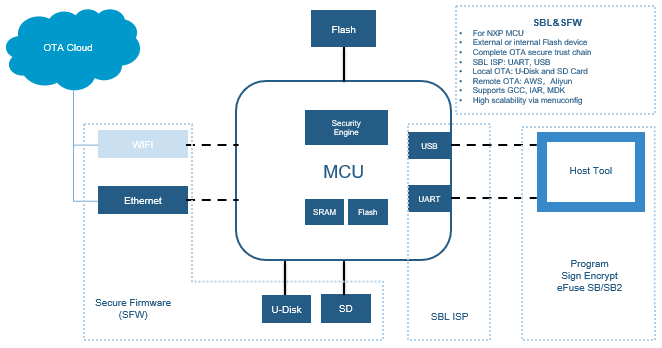
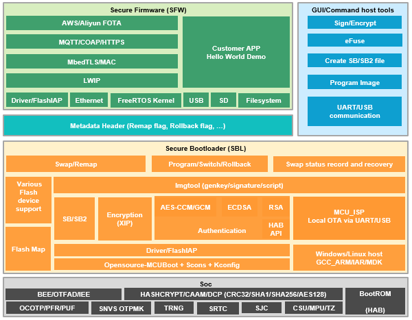

# MCU-OTA SBL Project

## 1. SBL Introduction

- Secure Bootloader(SBL) project is used for secure OTA.  
  The SBL project diagram is as below.  
    
  The SBL project architecture is as below.  
    

- Toolchains supported by this project  
  * __Windows host__  
    (1) MDK5 v5.30  
    (2) arm-none-eabi-gcc  
    (3) IAR v8.50  
  * __Linux host__  
    arm-none-eabi-gcc

- Platforms supported by this project  
  1. i.MXRTxxxx  
  2. i.MXRTxxx  
  3. LPC
  
- Other host system requirements
  1. Git

## 2. Quick Start
**Use i.MXRT1170 platform as an example**  

**-- Note --**  
All platforms in target directory are decoupled. So if you only focus on one platform, after clone the whole sbl project, you can delete other platforms in target directory directly.

### 2.1 Linux Host

1. Install SCons.  
   Ubuntu, Debian: `$ sudo apt-get install scons`  
   RPM-based (Red Hat, SUSE, Fedora ...): `$ sudo yum install scons`
2. Install the gcc toolchain like: *gcc-arm-none-eabi-9-2019-q4-major*
3. Clone this project.  
   `$ git clone https://github.com/NXPmicro/sbl.git`
4. Enter the evkmimxrt1170 directory.  
   `$ cd target/evkmimxrt1170/`
5. Config the evkmimxrt1170 project.  
   `$ scons --menuconfig`
6. Set '**EXEC_PATH**' as gcc toolchain install path for `CROSS_TOOL == 'gcc'` in `sblprofile.py`.  
   Below is an example:  
   `EXEC_PATH   = r'/opt/share/toolchain/gcc-arm-none-eabi-9-2019-q4-major/bin'`  
   Alternatively, '**SBL_EXEC_PATH**' can be added into Linux environment variable to cover the '**EXEC_PATH**'.
7. Build the image with gcc toolchain.  
   `$ scons`  
   then `sbl.bin` image is built in `sbl/target/evkmimxrt1170/build` directory.
8. Download the image.  
   Use DapLink drag-n-drop or other tools to download image.

### 2.2 Windows Host

1. Clone this project.  
   `git clone https://github.com/NXPmicro/sbl.git`
2. Enter the directory `sbl/target/evkmimxrt1170`.
3. Double click the batch file `env.bat`.
4. Config the evkmimxrt1170 project.  
   `scons --menuconfig`
5. Build and download the image.  
    * __with gcc toolchain__  
	(1) Obtain gcc toolchain from ARM or MinGW website and install to the Windows host.  
	(2) Set '**EXEC_PATH**' as gcc toolchain install path for `CROSS_TOOL == 'gcc'` in `sblprofile.py`.  
	    Below is an example:  
        `EXEC_PATH   = r'C:\Program Files (x86)\GNU Arm Embedded Toolchain\9 2020-q2-update\bin'`  
        Alternatively, '**SBL_EXEC_PATH**' can be added into Windows environment variable to cover the '**EXEC_PATH**'.  
	(3) Build the image.  
        `scons`  
	(4) Download the image.  
        Use DapLink drag-n-drop or other tools to download image.  
    * __with IAR IDE__  
    (1) Create IAR project.  
	    `scons --ide=iar`  
	(2) Enter the directory `sbl/target/evkmimxrt1170/iar`.  
	(3) Double-click the IAR project file `sbl.eww`.  
	(4) Click the "Make" button to build.  
	(5) Click the "Download" button to download.  
	* __with KEIL IDE__  
	(1) Create keil project.  
	    `scons --ide=mdk5`  
	(2) Enter the directory `sbl/target/evkmimxrt1170/mdk`.  
	(3) Double-click the keil project file `sbl.uvprojx`.  
	(4) Click the "Build" button to build.  
	(5) Click the "Download" button to download.

### 2.3 Others	

1. Please refer to the User Guide for more information in doc folder.
2. Please find SFW project from https://github.com/NXPmicro/sfw.
